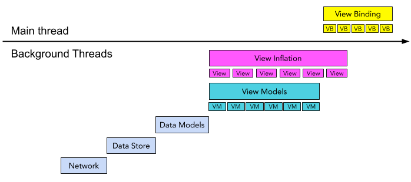

# Recycling Center
The Recycling Center is a framework for creating efficient RecyclerViews.
It is designed around an immutable `ViewModel` pattern, put together in logical
`Sections` of views.

The Recycling Center is as much a **pattern** as it is a library, preferring
**reactive, unidirectional data flow** using **immutable ViewModels**.

## Data, Models, and Views

## Reference
The Recycling Center uses several primitives to create an efficient `RecyclerView`.
See the [Adding a Custom View](docs/CustomView.md) guide for how they fit together.

* [AdapterViewType](./lib/src/main/java/com/snap/ui/recycling/AdapterViewType.kt):
Each view in the RecyclerView has an enumerated type.
* [AdapterViewModel](./lib/src/main/java/com/snap/ui/recycling/viewmodel/AdapterViewModel.java):
Contains all the data needed to render a view, ideally including any formatting.
* [ViewBinding](./lib/src/main/java/com/snap/ui/recycling/ViewBinding.kt):
Binding code that connects a `ViewModel` to its `View`.

A [ViewFactory](./lib/src/main/java/com/snap/ui/recycling/factory/ViewFactory.java)
creates a `View` from an `AdapterViewType`. The ViewFactory supports background-inflated
views from a
[ViewPrefetcher](./lib/src/main/java/com/snap/ui/recycling/prefetch/ViewPrefetcher.kt).

The Recycling Center `RecyclerView.Adapter` adhere to the
[ViewModelAdapter](./lib/src/main/java/com/snap/ui/recycling/adapter/ViewModelAdapter.java) interface.
There are a few different adapters for different use-cases:
* [BindingViewModelAdapter](./lib/src/main/java/com/snap/ui/recycling/adapter/BindingViewModelAdapter.java):
Basic adapter mapping a List of ViewModels in a RecyclerView.
* [SectionedRecyclerViewAdapter](./lib/src/main/java/com/snap/ui/recycling/adapter/SectionedRecyclerViewAdapter.java):
A sectioned ViewModelAdapter.
* [ObservableViewModelSectionAdapter](./lib/src/main/java/com/snap/ui/recycling/adapter/ObservableViewModelSectionAdapter.kt):
A sectioned adapter powered by `RxJava` Observables.

Instead of Lists of ViewModels, the Recycling Center uses a
[Seekable](./lib/src/main/java/com/snap/ui/seeking/Seekable.kt)
interface to bring content to an Adapter. This simplified interface
supports simple list-based binding via
[Seekables.copyOf(list)](./lib/src/main/java/com/snap/ui/seeking/Seekables.kt)
or  efficient, fluid binding from a `Cursor` or other seekable stream of data.

## Resources
* [RecyclerView](https://developer.android.com/guide/topics/ui/layout/recyclerview)
* [DiffUtil](https://developer.android.com/reference/androidx/recyclerview/widget/DiffUtil)