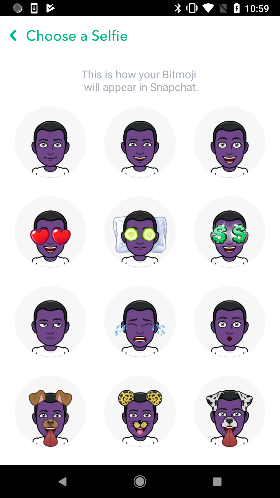

# Recycling Center Walkthrough

This tutorial will describe how to set up a simple RecyclerView using Recycling Center.
We will create a simple screen that presents a long, scrollable list of Bitmoji images.

<p align="center">

</p>

1. First we need to implement ```AdapterViewType``` which specifies the type of views in the recycler view. In this example, 
we have two types of views: 1) Top anchor and 2) Bitmoji selfie view. 

    Define two elements, `BITMOJI_SELFIE_TOP_ANCHOR` and `BITMOJI_SELFIE` in the enum class 
    ```BitmojiSelfieViewType```. This defines a mapping
    for each type from its View layout id to the binding class for each type of view:  
    ```kotlin
   enum class BitmojiSelfieViewType constructor(
            @LayoutRes private val layoutId: Int,
            private val viewBindingClass: Class<out ViewBinding<*>>? = null
   ) : BindingAdapterViewType {
    
        BITMOJI_SELFIE_TOP_ANCHOR(R.layout.mushroom_bitmoji_selfie_header),
        BITMOJI_SELFIE(BitmojiSelfieViewBinding.LAYOUT_ID, BitmojiSelfieViewBinding::class.java);
    
        @LayoutRes
        override fun getLayoutId() = layoutId
    
        override fun getViewBindingClass() = viewBindingClass
   }
    ``` 

2. Let's define ``AdapterViewModel`` for the top anchor and bitmoji selfie items before we move on to view binding. 

    Top anchor is always the same, we just need an ``AdapterViewModel`` that has a ```AdapterViewType```: 
    ```kotlin
    class BitmojiSelfieTopAnchorViewModel
          : AdapterViewModel(BitmojiSelfieViewType.BITMOJI_SELFIE_TOP_ANCHOR)
     ```

    The Bitmoji selfie item in the recycler view needs two fields to load its image,
    ``BitmojiAvatarId`` and ``BitmojiSelfieId``. 
    So we define its ViewModel class ``BitmojiSelfieViewModel`` as: 
    ```kotlin
    data class BitmojiSelfieViewModel(
            val bitmojiAvatarId: String,
            val bitmojiSelfieId: String, 
            val bitmojiFeature: BitmojiFeature
    ) : AdapterViewModel(BitmojiSelfieViewType.BITMOJI_SELFIE) {
        
        override fun areContentsTheSame(model: AdapterViewModel): Boolean {
            val otherModel = model as BitmojiSelfieViewModel
            return this.bitmojiAvatarId == otherModel.bitmojiAvatarId &&
                    this.bitmojiSelfieId == otherModel.bitmojiSelfieId
        }
     
        val uri = BitmojiUriBuilder.build(bitmojiAvatarId, bitmojiSelfieId, Feature.BITMOJI)
    }
    ```

3. Next we need a class that binds an ```AdapterViewModel```(ex: ```BitmojiSelfieViewModel```) to its specific ```View```.

    Note that we don't have ```ViewBinding``` class for top anchor because we don't need anything to bind for the anchor. 
    We just use the view provided by the layout for the top anchor. The ```BitmojiSelfieViewBinding``` is below, 
    which implements methods to set the Bitmoji selfie item's properties. ```onCreate()``` sets the listener and 
    ```onBind()``` sets the image uri of the view using avatar id and selfie id stored in the ```BitmojiSelfieViewModel```.
    
    ```kotlin
    class BitmojiSelfieViewBinding : ViewBinding<BitmojiSelfieViewModel>() {
    
        companion object {
            val LAYOUT_ID = R.layout.mushroom_bitmoji_selfie_item
            val IMAGE_ID = R.id.bitmoji_selfie_image
        }
    
        lateinit var selfieImageView: SnapImageView
    
        override fun onCreate(itemView: View) {
            selfieImageView = itemView.findViewById(IMAGE_ID)
            selfieImageView.setOnClickListener(this::onClick)
        }
    
        override fun onBind(model: BitmojiSelfieViewModel, previousModel: BitmojiSelfieViewModel?) {
            selfieImageView.setImageUri(model.uri, model.bitmojiFeature.page)
        }
    
        fun onClick(view: View) {
            eventDispatcher.dispatch(BitmojiSelfieItemClickEvent(model, itemView))
        }
    }
    ```

4. As noted in step 1, we have two view types and two sections: one for the anchor, and one for our content.
   We define two  `ObservableSectionController` classes for each section: `BitmojiSelfieItemsSection` and
 BitmojiSelfieTopAnchorSection`.
 
    Top anchor section doesn't change the content, so it's simple:
    ```kotlin
    class BitmojiSelfieTopAnchorSection : MainThreadDisposable(), ObservableSectionController {
    
        val anchorModel = BitmojiSelfieTopAnchorViewModel()
    
        override fun getViewModels(): Observable<Seekable<AdapterViewModel>> {
            return Observable.just(Seekables.of(anchorModel as AdapterViewModel))
        }
    }
    ```
    
    Bitmoji selfie items are built using avatarId from ```userSessionObservable``` and selfieId from 
    ```bitmojiTemplatesObservable```. Using the ```Observable.combineLatest()```, we return 
    ```Observable<Seekable<BitmojiSelfieViewModel>>```.  
    ```kotlin
    class BitmojiSelfieItemsSection(
            val userAuthStore: SnapUserStore,
            val bitmojiTemplateManager: BitmojiTemplateManager
    ): MainThreadDisposable(), ObservableSectionController {
    
        override fun getViewModels(): Observable<Seekable<AdapterViewModel>> {
            val userSessionObservable = userAuthStore.observeUserSession()
            val bitmojiTemplatesObservable = bitmojiTemplateManager.observeBitmojiTemplates()
    
            return Observable.combineLatest(userSessionObservable, bitmojiTemplatesObservable,
                    BiFunction<UserSession, BitmojiTemplates, Seekable<AdapterViewModel>> {
                        userSession, bitmojiTemplateList ->
                        if (userSession.bitmojiAvatarId == null ||
                                bitmojiTemplateList.selfieTemplateIds == null) {
                            Seekables.empty<AdapterViewModel>()
                        } else {
                            val models = bitmojiTemplateList.selfieTemplateIds.map { selfieId ->
                                userSession.bitmojiAvatarId!!.let { avatarId ->
                                    BitmojiSelfieViewModel(avatarId, selfieId)
                                }
                            }
                            Seekables.copyOf(models)
                        }
                    })
        }
    }
    ```

5. Now we can start to use ```recycling-center``` in ```BitmojiSelfiePresenter```.
    
    First we create the ```ViewFactory``` with ```BitmojiSelfieViewType``` (Note that ViewFactory class has different 
    types of constructors. Choose appropriate one accordingly with your use case)  
    ```kotlin
    @OnLifecycleEvent(Lifecycle.Event.ON_START)
    fun onFragmentStart() {
        // other initialization codes omitted 
       recyclerView = it.recyclerView
       viewFactory = ViewFactory(BitmojiSelfieViewType::class.java)
       initAdapter()
    }
    ```
    
    Initialize `ObservableViewModelSectionAdapter` with `ViewFactory` initialized above, `RxBus`,
    schedulers, and `List<ObservableSectionController>`. Make sure to do three things after initializing
    `ObservableViewModelSectionAdapter`: 
    1. Set adapter for recyclerView: `recyclerView.adapter = adapter.recyclerViewAdapter`
    2. Set layout manager: `recyclerView.layoutManager = [LayoutManager that meets your needs]`
    3. Subscribe adapter and make sure it's properly disposed: `adapter.subscribe().bindTo(this)`
    ```kotlin
    private fun initAdapter() {
       val sections: ImmutableList<ObservableSectionController> = ImmutableList.of(
                    BitmojiSelfieTopAnchorSection(),
                    BitmojiSelfieItemsSection(userAuthStore, bitmojiFsnHttpInterface,
                            bitmojiFeature, bitmojiTemplateManager))
            
       adapter = ObservableViewModelSectionAdapter(viewFactory, bus.eventDispatcher,
                    Schedulers.computation(), sections.toList())
            
       recyclerView.adapter = adapter.recyclerViewAdapter
       recyclerView.layoutManager = GridLayoutManager(context, SELFIES_PER_ROW)
       recyclerView.addItemDecoration(getBitmojiSelfieItemDecoration())
    
       adapter.subscribe().bindTo(this)
    }
    ```

6. Compile and enjoy your recycler view! 

    