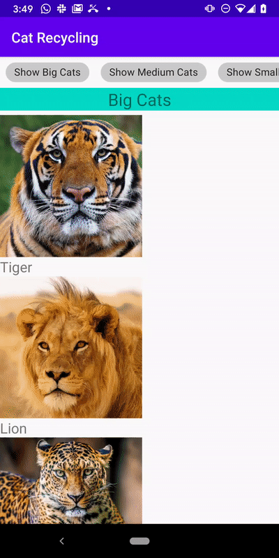

## Cat Recycling
Cat Recycling demonstrates how to use Recycling Center to build a RecyclerView, with a reactive design. This example highlights:

* UI powered by a reactive data flow and immutable ViewModels
* Use of [Stable Ids](https://developer.android.com/reference/kotlin/androidx/recyclerview/widget/RecyclerView.Adapter#hasstableids) for flicker-free animations
* Section-oriented RecyclerView UI
* Nesting a horizontal RecyclerView

